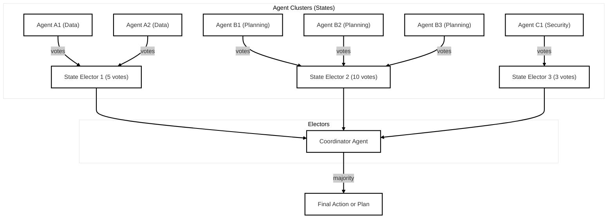

# Electoral "RAG": Republic of Agents Governance

A research prototype exploring governance-inspired coordination strategies in multi-agent AI systems.


This project simulates a democratic decision-making process among LLM-based agents — modeled after the U.S. electoral system — to reason, vote, and act collaboratively on complex tasks. The system compares hierarchical, democratic, and electoral college-style approaches to evaluate performance, robustness, and interpretability in distributed agent environments.

## Why?

Many multi-agent systems rely on flat hierarchical designs. In the real-world, humans govern often democratically. Were drawing inspiration from political structures like the Electoral College, popular votes, and checks-and-balances.

## The System
Agents reason individually and cast votes. Electors aggregate group decisions. The Coordinator Agent collects electoral outcomes and executes final actions.



- **Elector Aggregation**: Weighted "state" electors aggregate group decisions.
- **Coordinator Agent**: Collects electoral outcomes and executes final actions.
- **Benchmarking Tools**: Compare decision quality, latency, and cost across governance models.

## Example Scenarios

- Choosing optimal plans from multiple LLM agent proposals  
- Prioritizing features for an app from subdomain agents (e.g., UI, Backend, Security)  
- Deciding on procurement strategies using weighted expert groups  
- Writing a Jira ticket
- Writing a PR description

## Quick-start

Follow the steps below to set up a fresh virtual environment, install the required dependencies, and run a demo election locally. The only prerequisite is Python 3.9 or newer.

```bash
# Create an isolated virtual environment
python -m venv .venv
source .venv/bin/activate

# Install the dependencies
pip install --upgrade pip
pip install -r requirements.txt

# Run the built-in demo in the terminal
python agent_voting_system.py
```

### Using GPT-4o instead of the random agent

If you have an OpenAI API key you can power each agent with GPT-4o. Simply export your key **before** running the demo:

```bash
export OPENAI_API_KEY="sk-..."
python agent_voting_system.py
```

The system will automatically detect the environment variable and switch to `ChatGPTAgent` for a more meaningful election.

You can also create a .env file and add your OpenAI API key to it.

---

## Running as an Agent-to-Agent (A2A) service

The repository also ships with a minimal HTTP server that exposes the coordinator through [Google's Agent-to-Agent protocol](https://github.com/a2aproject/a2a-python). To start the service run:


```bash
python a2a_voting_server.py
```

The server listens on `http://localhost:5000` by default (change the port via `PORT=…`). Once it is up you can

```bash
# Inspect the agent card              
curl http://localhost:5000/.well-known/agent.json | jq

# Delegate an arbitrary task via the a2a CLI
pip install python-a2a[cli]   # one-off

a2a send http://localhost:5000 "Design a data warehouse for e-commerce"
```

---

## File overview

- `agent_voting_system.py` – core logic: agents, electors, coordinator, demo main
- `chatgpt_agent.py` – optional drop-in replacement backed by the OpenAI Chat Completion API
- `a2a_voting_server.py` – HTTP wrapper that exposes the coordinator as an A2A agent

---

## License

This project is licensed under the terms of the MIT licence. See the `LICENSE` file for details.
