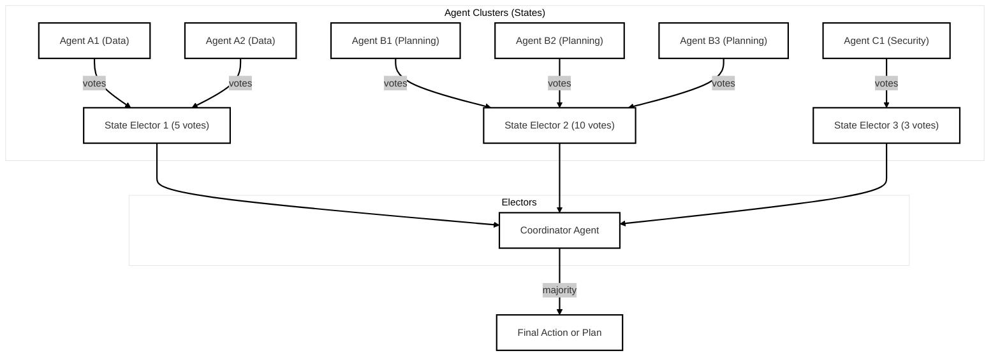

# Electoral RAG: Republic of Agents Governance

A research prototype exploring governance-inspired coordination strategies in multi-agent AI systems.

This project simulates a democratic decision-making process among LLM-based agents — modeled after the U.S. electoral system — to reason, vote, and act collaboratively on complex tasks. The system compares hierarchical, democratic, and electoral college-style approaches to evaluate performance, robustness, and interpretability in distributed agent environments.

## Why?

Many multi-agent systems rely on flat hierarchical designs. In the real-world, humans govern often democratically. Were drawing inspiration from political structures like the Electoral College, popular votes, and checks-and-balances.

## The System
Agents reason individually and cast votes. Electors aggregate group decisions. The Coordinator Agent collects electoral outcomes and executes final actions.

- **Elector Aggregation**: Weighted “state” electors aggregate group decisions.
- **Coordinator Agent**: Collects electoral outcomes and executes final actions.
- **Benchmarking Tools**: Compare decision quality, latency, and cost across governance models.

## Example Scenarios

- Choosing optimal plans from multiple LLM agent proposals  
- Prioritizing features for an app from subdomain agents (e.g., UI, Backend, Security)  
- Deciding on procurement strategies using weighted expert groups  
- Writing a Jira ticket
- Writing a PR description